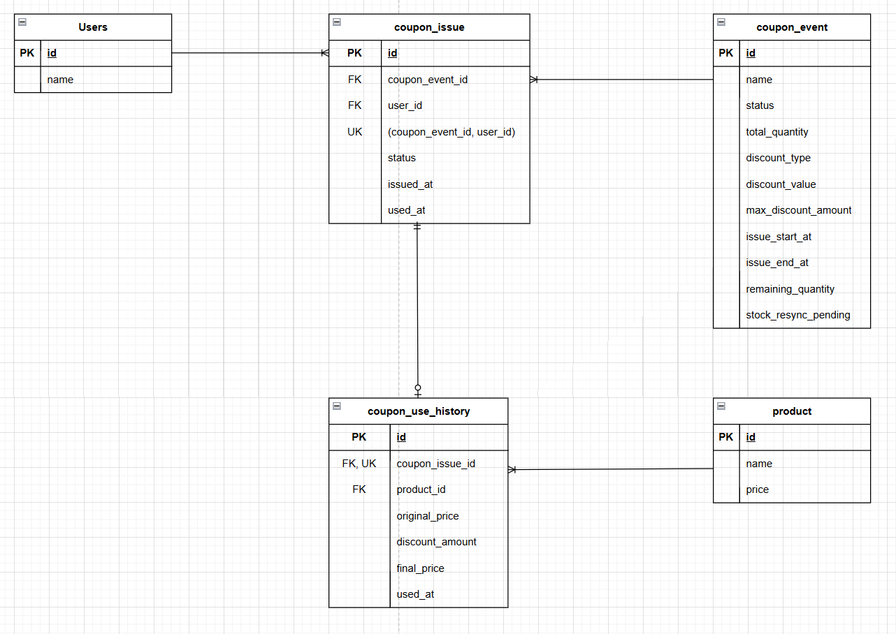

# Coupon Service

Redis Lua Script를 활용해 쿠폰 재고 차감과 중복 발급 검사를 원자적으로 처리하는 쿠폰 발급 서비스입니다.

쿠폰 이벤트 생성, 선착순 쿠폰 발급, 쿠폰 사용, 사용 가능한 쿠폰 조회, 재고 재동기화 기능을 제공합니다.

## 기술 스택

- Java 17
- Spring Boot 4.0.5
- Spring Data JPA
- Spring Data Redis
- QueryDSL 5.0.0
- MySQL
- Redis
- Gradle
- JUnit 5

## 주요 기능

- 쿠폰 이벤트 생성
- 쿠폰 이벤트 검색
- 만료된 쿠폰 이벤트 자동 종료
- Redis Lua 기반 쿠폰 발급 선점
- 중복 발급 방지
- 품절 처리
- 쿠폰 사용
- 쿠폰 사용 이력 저장
- 사용 가능한 유저 쿠폰 조회
- Redis/DB 재고 재동기화

## 핵심 설계

쿠폰 발급은 Redis에서 먼저 선점하고, 이후 DB 트랜잭션으로 최종 발급 이력을 저장합니다.

Redis Lua Script에서는 다음 작업을 하나의 원자적 흐름으로 처리합니다.

- 발급 상태 초기화 여부 확인
- 발급 시작/종료 시간 확인
- 중복 발급 여부 확인
- 재고 확인
- 재고 차감
- 발급 유저 등록

DB에서는 다음 정보를 최종 상태로 관리합니다.

- 쿠폰 이벤트
- 남은 재고
- 쿠폰 발급 이력
- 쿠폰 사용 이력
- 재고 재동기화 필요 여부

## 쿠폰 발급 흐름

1. Redis Lua Script로 발급 가능 여부를 확인합니다.
2. Redis 재고를 차감하고 발급 유저를 등록합니다.
3. DB에서 유저와 쿠폰 이벤트를 조회합니다.
4. 쿠폰 이벤트 상태, 발급 기간, 재동기화 대기 여부를 검증합니다.
5. DB 쿠폰 이벤트 재고를 차감합니다.
6. 쿠폰 발급 이력을 저장합니다.
7. DB 트랜잭션이 실패하면 Redis 선점을 취소합니다.
8. Redis 취소도 불확실한 경우 재동기화 대기 상태로 전환합니다.

## Redis/DB 정합성 처리

Redis 선점 이후 DB 처리에 실패할 수 있으므로, 트랜잭션 완료 시점에 Redis 상태를 정리합니다.

- DB 트랜잭션 commit 성공: Redis 선점 유지
- DB 트랜잭션 rollback: Redis 재고와 발급 유저 정보 원복
- 상태 불명확 또는 복구 실패: `stockResyncPending = true`

`stockResyncPending` 상태의 이벤트는 발급을 차단합니다.

관리자 재동기화 API를 호출하면 DB 발급 이력을 기준으로 Redis 재고와 발급 유저 Set을 다시 구성하고, 재동기화 상태를 해제합니다.

## 부하 테스트 및 성능 개선

선착순 쿠폰 발급 구조의 동시성 한계를 확인하기 위해 nGrinder로 부하 테스트를 진행했습니다.

초기에는 DB 트랜잭션 안에서 쿠폰 이벤트 row에 비관적 락을 걸고 재고 차감과 발급 이력 저장을 처리했습니다. 이 방식은 재고 정합성은 보장했지만, 동시 요청이 특정 쿠폰 이벤트 row에 집중될 경우 모든 요청이 동일한 row lock을 기다려야 하는 한계가 있었습니다.

DB 비관적 락 기반 구조에서는 1,000 VUser 조건까지 발급 정합성을 검증했으며, 1,500 VUser 이상부터 응답 지연과 실패가 증가하는 처리량 한계를 확인했습니다.

이후 Redis Lua Script 기반 구조로 개선하여 DB 진입 전에 발급 가능 여부 확인, 중복 발급 확인, 재고 차감, 발급 유저 등록을 일괄 처리하도록 변경했습니다.

### 개선 결과

| 항목 | DB 비관적 락 기반 | Redis Lua Script 기반 |
| --- | ---: | ---: |
| 1,000 VUser 평균 응답 시간 | 약 2,378ms | 약 240ms |
| 응답 시간 개선 | - | 약 90% 감소 |
| TPS | 기준값 | 약 2.4배 개선 |
| 안정 처리 구간 | 1,000 VUser | 4,000 VUser |

### Redis 도입 후 테스트 요약

| VUser | 정상 처리 결과 |
| ---: | --- |
| 1,000 | 2/2 정상 |
| 2,000 | 2/2 정상 |
| 3,000 | 2/2 정상 |
| 4,000 | 3/3 정상 |
| 5,000 | 2/3 정상 |
| 6,000 | 3/4 정상 |
| 7,020 | 1/3 정상 |

Redis 도입 후 1,000~4,000 VUser 구간에서는 모든 회차에서 중복 발급 없이 정상 처리되었습니다. 5,000 VUser 이상부터는 일부 회차에서 실패가 발생하여, 현재 로컬 테스트 환경 기준 안정 통과 구간을 4,000 VUser로 판단했습니다.

<details>
<summary>Redis 도입 후 상세 테스트 기록</summary>

| VUser | 회차 | Agent | Process | Thread | TPS | Peak TPS | 평균 응답 시간(ms) | 소요 시간 | DB 발급 수 | 결과 |
| ---: | ---: | ---: | ---: | ---: | ---: | ---: | ---: | --- | ---: | --- |
| 1,000 | 1차 | 1 | 2 | 500 | 600.2 | 0.0 | 260.94 | 00:00:08 | 1,000 | 정상 |
| 1,000 | 2차 | 1 | 2 | 500 | 593.7 | 0.0 | 202.20 | 00:00:08 | 1,000 | 정상 |
| 2,000 | 1차 | 1 | 4 | 500 | 563.3 | 809.0 | 307.51 | 00:00:16 | 2,000 | 정상 |
| 2,000 | 2차 | 1 | 4 | 500 | 1,063.5 | 0.0 | 103.36 | 00:00:14 | 2,000 | 정상 |
| 3,000 | 1차 | 1 | 6 | 500 | 817.1 | 1,052.5 | 187.67 | 00:00:19 | 3,000 | 정상 |
| 3,000 | 2차 | 1 | 6 | 500 | 838.4 | 1,397.5 | 363.65 | 00:00:20 | 3,000 | 정상 |
| 4,000 | 1차 | 2 | 4 | 500 | 519.6 | 897.0 | 526.80 | 00:00:30 | 4,000 | 정상 |
| 4,000 | 2차 | 2 | 4 | 500 | 551.8 | 651.0 | 597.72 | 00:00:29 | 4,000 | 정상 |
| 4,000 | 3차 | 2 | 4 | 500 | 557.0 | 1,015.5 | 600.05 | 00:00:30 | 4,000 | 정상 |
| 5,000 | 1차 | 2 | 5 | 500 | 549.1 | 1,325.5 | 657.42 | 00:00:39 | 5,000 | 정상 |
| 5,000 | 2차 | 2 | 5 | 500 | 679.8 | 1,451.0 | 486.56 | 00:00:35 | 4,804 | 비정상 |
| 5,000 | 3차 | 2 | 5 | 500 | 682.2 | 914.5 | 407.77 | 00:00:35 | 5,000 | 정상 |
| 6,000 | 1차 | 2 | 6 | 500 | 632.8 | 991.0 | 599.18 | 00:00:45 | 6,000 | 정상 |
| 6,000 | 2차 | 2 | 6 | 500 | 663.8 | 1,099.0 | 649.96 | 00:00:42 | 6,000 | 정상 |
| 6,000 | 3차 | 2 | 6 | 500 | 629.5 | 928.5 | 723.49 | 00:00:40 | 5,921 | 비정상 |
| 6,000 | 4차 | 2 | 6 | 500 | 504.5 | 1,378.0 | 742.52 | 00:00:52 | 6,000 | 정상 |
| 7,020 | 1차 | 3 | 3 | 780 | 468.1 | 1,477.5 | 869.15 | 00:00:42 | 7,020 | 정상 |
| 7,020 | 2차 | 3 | 3 | 780 | 876.7 | 2,629.5 | 89.35 | 00:00:40 | 6,767 | 비정상 |
| 7,020 | 3차 | 3 | 3 | 780 | 1,187.7 | 1,302.5 | 164.24 | 00:00:29 | 6,904 | 비정상 |

</details>

### 최종 검증 기준

nGrinder의 HTTP 성공 수만으로 성공 여부를 판단하지 않고, DB와 Redis의 최종 상태를 함께 검증했습니다.

```text
DB 발급 건수
DB COUNT(DISTINCT user_id)
Redis issued-users SCARD
Redis stock
DB coupon_event.remaining_quantity
```

이를 통해 정해진 수량만 발급되었고, 중복 발급 없이 DB와 Redis 재고 정합성이 유지되는지 확인했습니다.

## 프로젝트 구조

```text
src/main/java/com/dev/coupon
├── common
│   ├── config          # QueryDSL 설정
│   ├── exception       # 공통 예외, 에러 응답 처리
│   └── util            # Redis Key, Lua Script Loader
├── coupon
│   ├── controller      # 쿠폰 이벤트, 발급, 사용 API
│   ├── domain          # CouponEvent, CouponIssue, CouponUseHistory
│   ├── dto             # 쿠폰 이벤트 생성, 발급, 사용 요청/응답
│   ├── exception       # 쿠폰 도메인 예외 코드
│   ├── repository      # JPA Repository, QueryDSL 조회 구현
│   ├── scheduler       # 만료 이벤트 상태 변경 스케줄러
│   └── service         # 발급, 사용, Redis 선점, 재고 복구/재동기화
├── product
│   ├── controller      # 관리자 상품 API
│   ├── domain          # Product
│   ├── dto             # 상품 생성/조회 요청, 응답
│   ├── exception       # 상품 도메인 예외 코드
│   ├── repository      # JPA Repository, QueryDSL 조회 구현
│   └── service         # 상품 생성, 조회
└── user
    ├── controller      # 유저 쿠폰 조회 API
    ├── domain          # User
    ├── dto             # 유저 쿠폰 조회 조건
    ├── exception       # 유저 도메인 예외 코드
    ├── repository      # JPA Repository
    └── service         # 사용 가능한 유저 쿠폰 조회

src/main/resources
└── lua/coupon
    ├── init_event_issue_state.lua
    ├── reserve_coupon.lua
    ├── reserve_coupon_rollback.lua
    └── recovery_stock.lua
```

## ERD


## API

### 쿠폰 이벤트

| Method | URL | Description |
| --- | --- | --- |
| POST | `/api/admin/coupon-events` | 쿠폰 이벤트 생성 |
| GET | `/api/admin/coupon-events` | 쿠폰 이벤트 검색 |
| POST | `/api/admin/coupon-events/{eventId}/resync` | 쿠폰 이벤트 재고 재동기화 |

### 쿠폰 발급

| Method | URL | Description |
| --- | --- | --- |
| POST | `/api/coupon-events/{couponEventId}/issues` | 쿠폰 발급 |

### 쿠폰 사용

| Method | URL | Description |
| --- | --- | --- |
| POST | `/api/coupon-issues/{couponIssueId}/use` | 쿠폰 사용 |

### 유저 쿠폰

| Method | URL | Description |
| --- | --- | --- |
| GET | `/api/users/{userId}/coupons` | 사용 가능한 유저 쿠폰 조회 |

### 상품

| Method | URL | Description |
| --- | --- | --- |
| POST | `/api/admin/products` | 상품 생성 |
| GET | `/api/admin/products` | 상품 조회 |

## 주요 Redis Key

쿠폰 이벤트별 Redis key는 다음 형식을 사용합니다.

```text
coupon:event:{eventId}:stock
coupon:event:{eventId}:issued-users
coupon:event:{eventId}:issue-start-at
coupon:event:{eventId}:issue-end-at
```

Redis Set 조회 예시:

```redis
smembers coupon:event:{eventId}:issued-users
scard coupon:event:{eventId}:issued-users
sismember coupon:event:{eventId}:issued-users {userId}
```

## 테스트

주요 테스트 범위는 다음과 같습니다.

- 쿠폰 이벤트 생성 및 Redis 초기화
- Redis 초기화 실패 시 재동기화 대기 처리
- 쿠폰 이벤트 검색
- 만료 이벤트 종료 처리
- 쿠폰 할인 정책 계산
- 쿠폰 이벤트 생성 요청 validation
- 쿠폰 발급 정상/실패 흐름
- 쿠폰 발급 동시성
- 쿠폰 사용 정상/실패 흐름
- 쿠폰 사용 동시성
- 재고 재동기화 복구

## 스케줄러

만료된 쿠폰 이벤트는 스케줄러를 통해 주기적으로 종료됩니다.

```text
fixedDelay = 60000
```

`OPEN` 상태이고 발급 종료 시간이 지난 이벤트는 `CLOSED` 상태로 변경됩니다.
