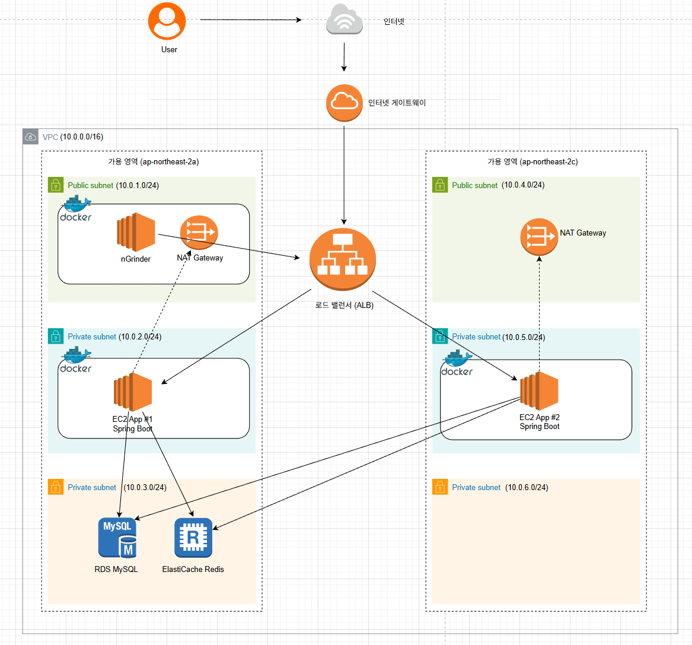

# Coupon Service

## 소개

선착순 쿠폰 발급 상황에서 발생할 수 있는 재고 초과 발급, 중복 발급, 특정 쿠폰 이벤트 row lock 병목 문제를 해결하기 위해 구현한 쿠폰 발급 시스템입니다.

- 개발 기간: 2026.04.16 ~ 2026. 05. 10
- 개발 인원: 개인 프로젝트

Redis Lua Script로 쿠폰 발급 가능 여부를 원자적으로 선점하고, DB row lock과 유니크 제약으로 최종 정합성을 보장합니다.

쿠폰 이벤트 생성, 선착순 쿠폰 발급, 쿠폰 사용, 사용 가능한 쿠폰 조회, 재고 재동기화 기능을 제공합니다.

## AWS 배포 아키텍처



## 기술 스택

- Java 17
- Spring Boot 4.0.5
- Spring Data JPA
- Spring Data Redis
- QueryDSL 5.0.0
- MySQL
- Redis
- Gradle
- JUnit 5

## 주요 기능

- 쿠폰 이벤트 생성
- 쿠폰 이벤트 검색
- 만료된 쿠폰 이벤트 자동 종료
- Redis Lua 기반 쿠폰 발급 선점
- 중복 발급 방지
- 품절 처리
- 쿠폰 사용
- 쿠폰 사용 이력 저장
- 사용 가능한 유저 쿠폰 조회
- Redis/DB 재고 재동기화

## 핵심 설계

쿠폰 발급은 Redis에서 먼저 선점하고, 이후 DB 트랜잭션으로 최종 발급 이력을 저장합니다.

현재 구조는 Redis Lua Script와 DB row lock 기반의 비관적 동시성 제어를 함께 사용합니다.

Redis Lua Script는 발급 가능 여부를 DB 진입 전에 먼저 판단하는 선점 계층입니다. 중복 발급, 품절, 발급 기간 외 요청을 Redis에서 원자적으로 차단하여 불필요한 DB 트랜잭션 진입을 줄입니다.

DB에서는 Redis 선점에 성공한 요청에 대해서만 최종 발급 이력을 저장하고, 쿠폰 이벤트 재고 차감 시 row lock을 통해 최종 재고 정합성을 보장합니다. 즉, Redis는 부하를 줄이는 1차 방어선이고, DB 비관적 락은 최종 원장인 DB의 정합성을 보장하는 2차 방어선입니다.

Redis Lua Script에서는 다음 작업을 하나의 원자적 흐름으로 처리합니다.

- 발급 상태 초기화 여부 확인
- 발급 시작/종료 시간 확인
- 중복 발급 여부 확인
- 재고 확인
- 재고 차감
- 발급 유저 등록

DB에서는 다음 정보를 최종 상태로 관리합니다.

- 쿠폰 이벤트
- 남은 재고
- 쿠폰 발급 이력
- 쿠폰 사용 이력
- 재고 재동기화 필요 여부

## 쿠폰 발급 흐름

1. Redis Lua Script로 발급 가능 여부를 확인합니다.
2. Redis 재고를 차감하고 발급 유저를 등록합니다.
3. DB에서 유저와 쿠폰 이벤트를 조회합니다.
4. 쿠폰 이벤트 상태, 발급 기간, 재동기화 대기 여부를 검증합니다.
5. DB 쿠폰 이벤트 재고를 차감합니다.
6. 쿠폰 발급 이력을 저장합니다.
7. DB 트랜잭션이 실패하면 Redis 선점을 취소합니다.
8. Redis 취소도 불확실한 경우 재동기화 대기 상태로 전환합니다.

## Redis/DB 정합성 처리

Redis 선점 이후 DB 처리에 실패할 수 있으므로, 트랜잭션 완료 시점에 Redis 상태를 정리합니다.

- DB 트랜잭션 commit 성공: Redis 선점 유지
- DB 트랜잭션 rollback: Redis 재고와 발급 유저 정보 원복
- 상태 불명확 또는 복구 실패: `stockResyncPending = true`

`stockResyncPending` 상태의 이벤트는 발급을 차단합니다.

관리자 재동기화 API를 호출하면 DB 발급 이력을 기준으로 Redis 재고와 발급 유저 Set을 다시 구성하고, 재동기화 상태를 해제합니다.

## 기술 상세

- **도입배경**
    - 초기에는 DB 트랜잭션 안에서 쿠폰 이벤트 row에 비관적 락을 걸고 재고 차감과 발급 이력 저장을 처리했습니다. 이 방식은 재고 정합성은 보장할 수 있었지만, 동시 요청이 특정 쿠폰 이벤트 row에 집중될 경우 모든 요청이 동일한 row lock을 대기해야 하는 한계가 있었습니다. nGrinder 부하 테스트를 통해 요청 수 증가에 따라 응답 시간이 증가하고 처리량이 제한되는 문제를 확인했고, 발급 가능 여부를 DB 앞단에서 먼저 처리하는 구조가 필요하다고 판단했습니다. 이를 개선하기 위해 DB 비관적 락을 최종 정합성 보장 장치로 유지하되, Redis Lua Script로 DB 진입 전 발급 가능 여부를 선점하는 구조를 도입했습니다.

- **사용이유**
    - 발급 가능 여부를 Redis에서 먼저 판단해 실패 요청이 DB 트랜잭션과 row lock까지 진입하지 않도록 하여 DB lock 경합 감소
    - 재고 확인, 중복 발급 확인, 재고 차감, 발급 유저 등록을 하나의 원자 연산으로 처리하여 초과 발급 방지
    - 품절, 중복 발급, 발급 기간 외 요청을 DB 접근 전에 차단하여 불필요한 DB 부하와 응답 지연 감소
    - 최종 발급 이력과 재고의 원장은 DB이므로 Redis 선점 이후 DB 트랜잭션에서 row lock 기반 재고 차감과 발급 이력 저장을 일관되게 처리
    - Redis는 앞단 선점 처리, DB는 row lock 기반 재고 차감과 유니크 제약을 통한 최종 정합성 보장 역할로 분리

- **성과**
    - DB 비관적 락 기반 구조에서는 nGrinder 1,000 VUser 조건까지 발급 정합성을 검증했으며, 1,500 VUser 이상부터 응답 지연과 실패가 증가하는 처리량 한계를 확인했습니다.
    - Redis Lua Script + DB row lock 기반 구조로 개선한 후, 발급 가능 여부를 DB 진입 전에 선점하여 DB row lock 경합을 줄였습니다.
    - 1,000 VUser 기준 평균 응답 시간은 DB 비관적 락 기반 약 2,378ms에서 AWS Redis Lua Script + DB row lock 기반 약 303ms로 감소했습니다. 이는 약 87% 응답 시간 감소입니다.
    - 1,000 VUser 기준 TPS는 DB 비관적 락 기반 대비 약 2.7배 개선되었습니다.
    - AWS 환경에서 ALB, App EC2 2대, RDS MySQL, ElastiCache Redis 구성으로 1,000~9,000 VUser 전 구간을 검증했고, 모든 정상 회차에서 초과 발급과 중복 발급 없이 목표 수량만 발급되었습니다.
    - 10,000 VUser는 nGrinder Agent 메모리 부족으로 강제 중단되어 애플리케이션 처리 한계로 판단하지 않았습니다.
    - nGrinder의 `Executed Tests`, `Successful Tests`는 참고 지표로만 사용하고, 최종 성공 여부는 DB 발급 건수, Redis 발급 유저 수, Redis 잔여 재고, nGrinder Errors를 교차 검증하여 판단했습니다.

| 항목 | DB 비관적 락 기반 | AWS Redis Lua Script + DB row lock 기반 |
| --- | ---: | ---: |
| 1,000 VUser 평균 응답 시간 | 약 2,378ms | 약 303ms |
| 응답 시간 개선 | - | 약 87% 감소 |
| 1,000 VUser TPS | 기준값 | 약 2.7배 개선 |

| 항목 | 검증 결과 |
| --- | --- |
| 테스트 환경 | AWS nGrinder -> ALB -> App EC2 2대 -> RDS MySQL / ElastiCache Redis |
| App EC2 | `c8i.xlarge` 2대 |
| nGrinder EC2 | `c8i.xlarge` 1대 |
| RDS | MySQL, `db.m7g.large` |
| Redis | ElastiCache Redis, `cache.t4g.medium` |
| 정상 검증 구간 | 1,000~9,000 VUser |
| 최대 정상 검증 | 9,000 VUser, 3/3 정상 |
| 10,000 VUser | nGrinder Agent 메모리 부족으로 미측정 |

### AWS 부하 테스트 요약

| VUser | 정상 처리 결과 | 평균 응답 시간(ms) |
| ---: | --- | --- |
| 1,000 | 2/2 정상 | 301~304 |
| 2,000 | 2/2 정상 | 126~141 |
| 3,000 | 2/2 정상 | 280~312 |
| 4,000 | 2/2 정상 | 274~421 |
| 5,000 | 2/2 정상 | 223~381 |
| 6,000 | 2/2 정상 | 197~309 |
| 7,005 | 2/2 정상 | 451~594 |
| 8,016 | 2/2 정상 | 725~748 |
| 9,000 | 3/3 정상 | 520~894 |
| 10,000 | Agent 메모리 부족으로 중단 | 미측정 |

<details>
<summary>AWS 부하 테스트 상세 기록</summary>

```text
VUser  회차  Agent  Process  Thread  TPS      Peak TPS  평균 응답 시간(ms)  소요 시간  DB 발급 수  Redis 재고  결과
-----  ----  -----  -------  ------  -------  --------  ------------------  --------  ----------  ----------  ------
1,000  1차   1      2        500     680.0    0.0       301.55              00:00:07  1,000       0           정상
1,000  2차   1      2        500     664.0    0.0       303.70              00:00:07  1,000       0           정상
2,000  1차   1      4        500     1,130.0  0.0       126.24              00:00:09  2,000       0           정상
2,000  2차   1      4        500     1,139.5  0.0       141.07              00:00:08  2,000       0           정상
3,000  1차   1      6        500     874.7    946.5     280.31              00:00:13  3,000       0           정상
3,000  2차   1      6        500     890.4    1,332.0   311.52              00:00:13  3,000       0           정상
4,000  1차   2      4        500     1,138.0  894.5     274.79              00:00:16  4,000       0           정상
4,000  2차   2      4        500     815.5    834.5     421.17              00:00:17  4,000       0           정상
5,000  1차   2      5        500     972.0    1,169.0   381.26              00:00:21  5,000       0           정상
5,000  2차   2      5        500     1,317.0  912.0     223.57              00:00:20  5,000       0           정상
6,000  1차   2      6        500     1,125.2  1,320.5   308.72              00:00:25  6,000       0           정상
6,000  2차   2      6        500     1,117.9  1,383.0   197.75              00:00:23  6,000       0           정상
7,005  1차   3      5        467     766.6    870.5     451.82              00:00:28  7,005       0           정상
7,005  2차   3      5        467     846.1    1,187.0   593.51              00:00:29  7,005       0           정상
8,016  1차   3      8        334     804.0    1,121.5   747.81              00:00:41  8,016       0           정상
8,016  2차   3      8        334     683.1    1,121.5   725.23              00:00:43  8,016       0           정상
9,000  1차   3      6        500     785.9    1,211.0   520.39              00:00:34  9,000       0           정상
9,000  2차   3      6        500     888.6    1,197.5   894.29              00:00:35  9,000       0           정상
9,000  3차   3      6        500     984.2    1,047.0   524.62              00:00:34  9,000       0           정상
```

</details>

### 최종 검증 기준

nGrinder의 `Executed Tests`, `Successful Tests`는 VUser 수보다 크게 집계되는 현상이 있어 참고 지표로만 사용했습니다.

최종 성공 여부는 아래 값을 기준으로 판단했습니다.

```text
DB coupon_issue 발급 수 = 목표 VUser 수
Redis issued-users 수 = 목표 VUser 수
Redis stock = 0
nGrinder Errors = 0
```

이를 통해 정해진 수량만 발급되었고, 중복 발급 없이 DB와 Redis 재고 정합성이 유지되는지 확인했습니다.

### 테스트 환경

- AWS 환경에서 nGrinder 기반 HTTP 부하 테스트 수행
- 테스트 대상은 개별 App EC2가 아니라 ALB DNS로 지정
- App EC2 2대는 각각 Docker Compose로 Spring Boot 애플리케이션 실행
- nGrinder Controller와 Agent는 같은 `c8i.xlarge` EC2에서 Docker 컨테이너로 실행
- Agent 수 증가는 물리 EC2 확장이 아니라 동일 EC2 내부의 논리 Agent 컨테이너 증가

## 프로젝트 구조

<details>
<summary>프로젝트 구조 보기</summary>

```text
src/main/java/com/dev/coupon
├── common
│   ├── config          # QueryDSL 설정
│   ├── exception       # 공통 예외, 에러 응답 처리
│   └── util            # Redis Key, Lua Script Loader
├── coupon
│   ├── controller      # 쿠폰 이벤트, 발급, 사용 API
│   ├── domain          # CouponEvent, CouponIssue, CouponUseHistory
│   ├── dto             # 쿠폰 이벤트 생성, 발급, 사용 요청/응답
│   ├── exception       # 쿠폰 도메인 예외 코드
│   ├── repository      # JPA Repository, QueryDSL 조회 구현
│   ├── scheduler       # 만료 이벤트 상태 변경 스케줄러
│   └── service         # 발급, 사용, Redis 선점, 재고 복구/재동기화
├── product
│   ├── controller      # 관리자 상품 API
│   ├── domain          # Product
│   ├── dto             # 상품 생성/조회 요청, 응답
│   ├── exception       # 상품 도메인 예외 코드
│   ├── repository      # JPA Repository, QueryDSL 조회 구현
│   └── service         # 상품 생성, 조회
└── user
    ├── controller      # 유저 쿠폰 조회 API
    ├── domain          # User
    ├── dto             # 유저 쿠폰 조회 조건
    ├── exception       # 유저 도메인 예외 코드
    ├── repository      # JPA Repository
    └── service         # 사용 가능한 유저 쿠폰 조회

src/main/resources
└── lua/coupon
    ├── init_event_issue_state.lua
    ├── reserve_coupon.lua
    ├── reserve_coupon_rollback.lua
    └── recovery_stock.lua
```

</details>

## ERD


## API

### 쿠폰 이벤트

| Method | URL | Description |
| --- | --- | --- |
| POST | `/api/admin/coupon-events` | 쿠폰 이벤트 생성 |
| GET | `/api/admin/coupon-events` | 쿠폰 이벤트 검색 |
| POST | `/api/admin/coupon-events/{eventId}/resync` | 쿠폰 이벤트 재고 재동기화 |

### 쿠폰 발급

| Method | URL | Description |
| --- | --- | --- |
| POST | `/api/coupon-events/{couponEventId}/issues` | 쿠폰 발급 |

### 쿠폰 사용

| Method | URL | Description |
| --- | --- | --- |
| POST | `/api/coupon-issues/{couponIssueId}/use` | 쿠폰 사용 |

### 유저 쿠폰

| Method | URL | Description |
| --- | --- | --- |
| GET | `/api/users/{userId}/coupons` | 사용 가능한 유저 쿠폰 조회 |

### 상품

| Method | URL | Description |
| --- | --- | --- |
| POST | `/api/admin/products` | 상품 생성 |
| GET | `/api/admin/products` | 상품 조회 |

## 테스트

주요 테스트 범위는 다음과 같습니다.

- 쿠폰 이벤트 생성 및 Redis 초기화
- Redis 초기화 실패 시 재동기화 대기 처리
- 쿠폰 이벤트 검색
- 만료 이벤트 종료 처리
- 쿠폰 할인 정책 계산
- 쿠폰 이벤트 생성 요청 validation
- 쿠폰 발급 정상/실패 흐름
- 쿠폰 발급 동시성
- 쿠폰 사용 정상/실패 흐름
- 쿠폰 사용 동시성
- 재고 재동기화 복구
